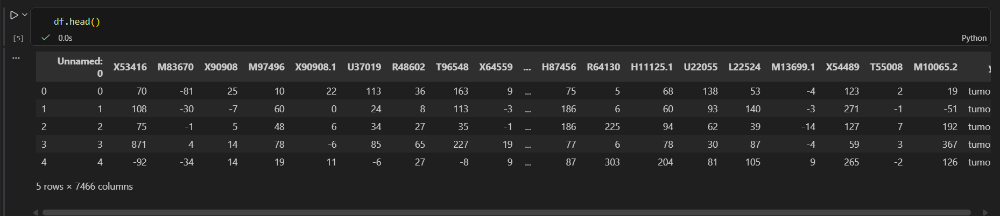
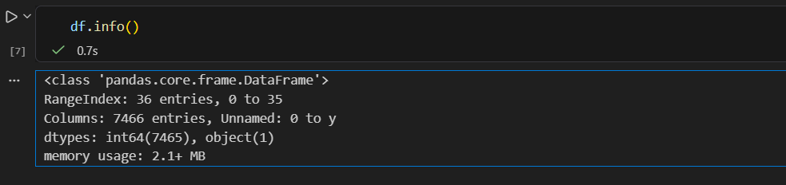
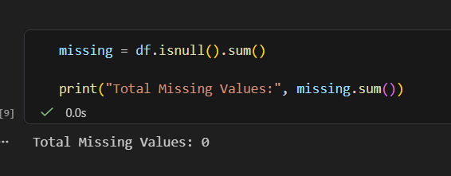
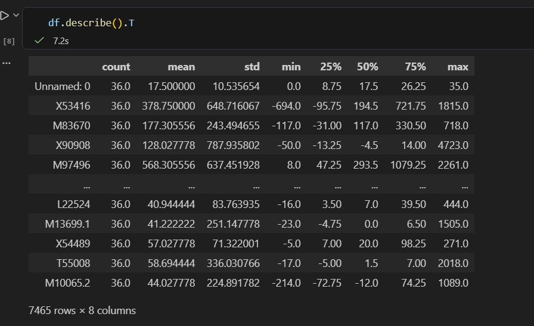
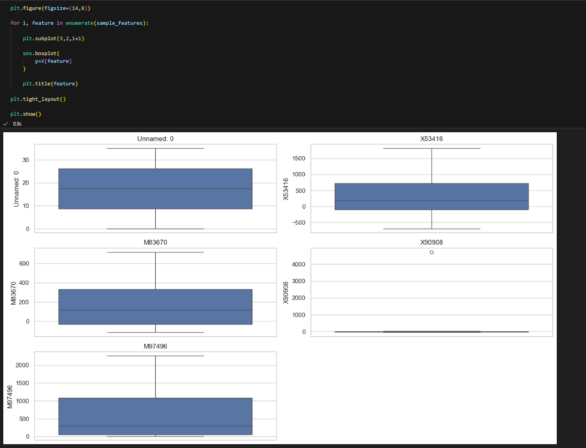
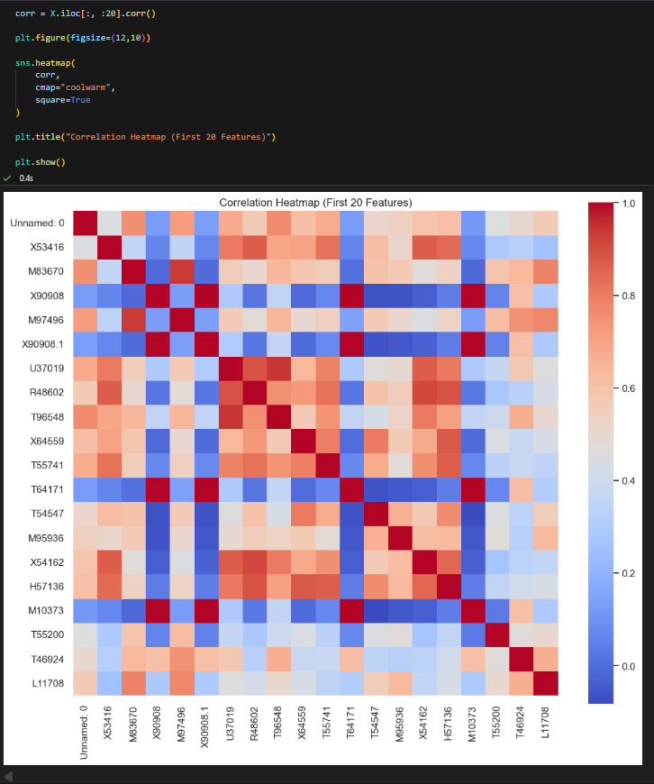
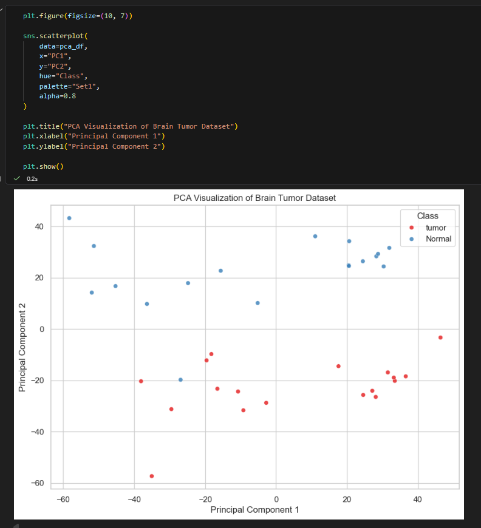

# VAUTECH IT SOLUTIONS – TASK 4

**Intern:** Aman Saifi  
**Intern ID:** VT26DS010  
**Domain:** Data Science  
**Company:** VAUTECH IT SOLUTIONS  
**Mentor:** Vishal Rajbhar  

---

# Task 4: Exploratory Data Analysis Using Visualizations

## Description

Perform Exploratory Data Analysis (EDA) on the Brain Tumor Gene Expression Dataset using statistical summaries and visualizations. The objective of this task is to understand the dataset, identify patterns, detect outliers, analyze feature distributions, and visualize relationships between variables before applying machine learning techniques.

---

## Objectives

- Analyze the dataset using descriptive statistics
- Visualize class distribution
- Identify missing values and duplicate records
- Explore feature distributions
- Detect outliers using boxplots
- Analyze correlations among features
- Apply PCA for dimensionality reduction and visualization
- Summarize key observations and conclusions

---

## Tools Used

- Python
- Pandas
- NumPy
- Matplotlib
- Jupyter Notebook / VS Code

---

## Dataset Information

**Dataset:** Brain Tumor Gene Expression Dataset

**Format:** CSV

**Source:** Cleaned Brain Tumor Dataset (CSV file provided for analysis)

---

## Step 1: Import Required Libraries

```python
import warnings
warnings.filterwarnings('ignore')

import pandas as pd
import numpy as np

import matplotlib.pyplot as plt
import seaborn as sns

from sklearn.decomposition import PCA
from sklearn.preprocessing import StandardScaler
```


## Step 2: Load Dataset

```python
df = pd.read_csv("cleaned_brain_tumor.csv")

print(df.shape)

df.head()
```



---

## Step 3: Dataset Overview

```python
df.tail()

df.info()

df.describe().T
```



---

## Step 4: Missing Value Analysis

```python
missing = df.isnull().sum()

print("Total Missing Values:", missing.sum())
```

```python
sns.barplot(
    x=["Missing Values"],
    y=[missing.sum()]
)
```



---

## Step 5: Duplicate Records & Class Distribution

```python
duplicates = df.duplicated().sum()

print("Duplicate Records:", duplicates)
```

```python
sns.countplot(
    x="y",
    data=df
)
```


## Step 6: Statistical Summary

```python
X = df.drop("y", axis=1)

X.describe().T.head()
```



---

## Step 7: Feature Variance Analysis

```python
variance = X.var().sort_values(ascending=False)

top20 = variance.head(20)
```

```python
top20.plot(kind="bar")
```


## Step 8: Feature Distribution

```python
sample_features = X.columns[:5]

sns.histplot(...)
```


## Step 9: Outlier Detection

```python
sns.boxplot(...)
```



---

## Step 10: Correlation Analysis

```python
corr = X.iloc[:, :20].corr()

sns.heatmap(corr)
```



---

## Step 11: Principal Component Analysis (PCA)

```python
scaler = StandardScaler()

X_scaled = scaler.fit_transform(X)

pca = PCA(n_components=2)

X_pca = pca.fit_transform(X_scaled)
```

```python
sns.scatterplot(
    data=pca_df,
    x="PC1",
    y="PC2",
    hue="Class"
)
```



---

## Step 12: Explained Variance

```python
explained = pca.explained_variance_ratio_

print(explained)
```


## Step 13: Statistical Summary Table

```python
summary = pd.DataFrame({
    "Mean": X.mean(),
    "Median": X.median(),
    "Std": X.std(),
    "Variance": X.var()
})

summary.head()
```


## Observations

- The dataset contains no missing values.
- Duplicate records have already been removed.
- Gene expression values are numerical and high-dimensional.
- Several features exhibit high variance.
- Boxplots indicate the presence of biological outliers.
- Correlation analysis reveals relationships among selected genes.
- PCA successfully reduces thousands of dimensions into two principal components while preserving the maximum variance.

---

## Conclusion

In this task, Exploratory Data Analysis (EDA) was successfully performed on the Brain Tumor Gene Expression dataset. Statistical summaries and multiple visualizations were used to understand feature distributions, detect missing values and outliers, analyze correlations, and visualize high-dimensional data using PCA. The analysis confirms that the dataset is clean, well-structured, and suitable for machine learning and predictive modeling.
